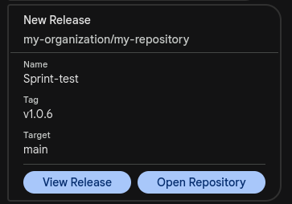

# Google Chat Release Message

A GitHub Action to send a release notification to Google Chat when a new release is created.



## Inputs

| Input         | Description               | Required |
|---------------|---------------------------|----------|
| `webhook-url` | Google Chat webhook URL  | Yes      |

## Usage Example

```yaml
name: Notify Google Chat on Release
on:
  release:
    types: [ created ]

jobs:
  your-job-name:
    runs-on: ubuntu-latest
    steps:
      (...)
      - name: Send Google Chat message
        uses: agro1desenvolvimento/gchat-release-msg@v1
        with:
          webhook-url: ${{ secrets.GOOGLECHAT_WEBHOOK_RELEASE_URL }}
      (...)
```
